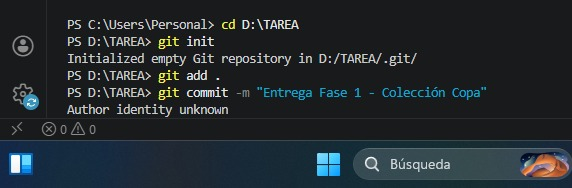
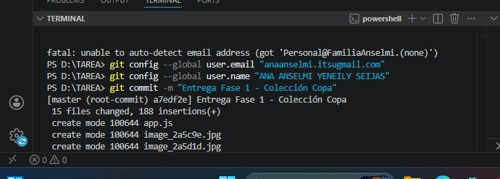
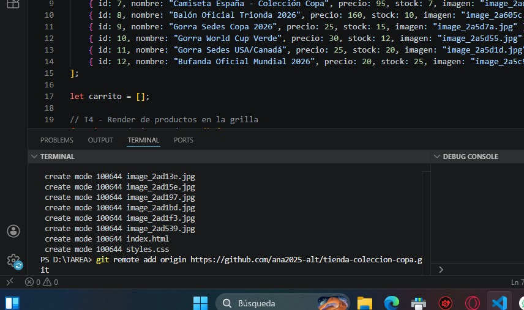
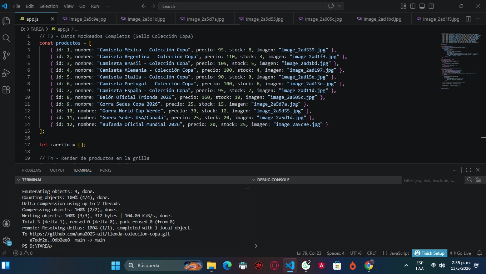

# Proyecto: Tienda Colección Copa 2026

**Estudiante:** Ana Anselmi , Yeneily Seijas
**Carrera:** Programación
**Entrega:** Fase 1 - Hackathon Clase 02

## Descripción
Este proyecto es una tienda ficticia de merchandising para el Mundial 2026, cumpliendo con el Brief 05. Incluye camisetas, pelotas, gorras y bufandas con el sello "Colección Copa".

## Funcionalidades de la Fase 1
- Catálogo dinámico de 12 productos.
- Carrito de compras funcional (agregar productos).
- Validación de stock en tiempo real.
- Aplicación automática de descuento (10%) al llevar 3 o más productos distintos.

## Cómo ejecutarlo
Para ver la página en funcionamiento, simplemente abre el archivo `index.html` en cualquier navegador moderno.

# 🏆 COLECCIÓN COPA 2026 - FASE 2

¡Bienvenido al repositorio oficial de la tienda de merchandising del Mundial! Este proyecto ha evolucionado a una aplicación web dinámica.

🏆 COLECCIÓN COPA 2026 - FASE 2

¡Repositorio actualizado! La tienda ya cuenta con lógica dinámica y gestión de datos.

## 🚀 Cambios Realizados
- **Objetos y Arreglos:** Catálogo de productos manejado con JavaScript.
- **Carrito Dinámico:** Cálculo de precios y descuentos automáticos.
- **Gestión de Stock:** El inventario se actualiza al comprar.
- **Captura de Datos:** Formulario para registrar clientes.

## 📸 Evidencias de la Fase 2
Aquí están las capturas de mi progreso:

 

### 🔄 Últimos Ajustes Realizados:
- **Interactividad:** Activación del buscador principal.
- **UI/UX:** Incorporación de fondo animado mundialista.
- **Seguridad:** Validación de formularios de envío. 
🔄 Actualización de Merchandising y Efectos Visuales
🥤 Inclusión de Nueva Línea de Productos (Termos)
Se expandió el catálogo de objetos en app.js para incluir artículos de hidratación oficial:

Termos de Acero Inoxidable: Modelos con aislamiento térmico y diseño "Copa 2026".

Edición Ejecutiva: Variantes en color negro con detalles dorados para un perfil más profesional.

Balones de Colección: Se sumaron modelos retro y ediciones especiales de sedes (Canadá/USA).

🎈 Sistema de Partículas Flotantes Dinámicas
Se mejoró la experiencia inmersiva en el index.html y styles.css:

Variedad de Objetos: Ahora no solo flotan balones (⚽), sino también trofeos (🏆) y termos (🥤), creando una atmósfera de tienda mundialista completa.

Lógica de Animación: Cada elemento tiene un animation-duration y animation-delay diferente generado en el HTML, lo que evita que todos suban al mismo tiempo y les da un movimiento más natural y aleatorio.

🌟 Efecto de Interacción (Shine Effect)
Se programó un efecto de "brillo viajero" en CSS usando el pseudo-elemento ::after y gradientes lineales. Al pasar el mouse sobre cualquier producto (camisetas, termos o balones), un destello recorre la tarjeta, resaltando el producto de manera elegante. 